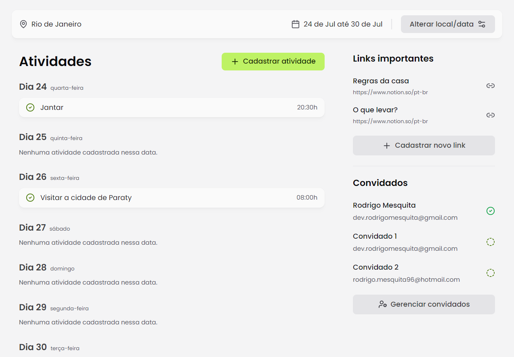

## Planner


# Descrição
É uma aplicação web para planejamento de viagens.


## Funcionalidades
- Criar uma viagem
- Convidar amigos
- Cadastrar atividades para a viagem
- Gerenciar convidados
- Cadastrar links

## Stack utilizada
- React.js
- React Router Dom
- TailwindCSS
- Tailwind Variants
- Date fns
- React Day Picker
- Lucide React

## Instalação

Após clonar o repositório, vá até a pasta do projeto e siga os comando abaixo:

```bash
 - pnpm install
 - pnpm dev
```
